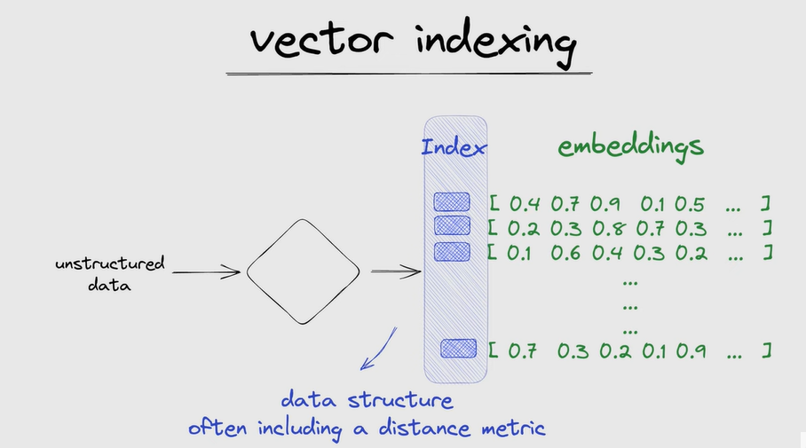

# Vector Database
A vector database indexes and stores vector embeddings for fast retrival and similarity searches.

# Process
First it converts the data(Strucuted/unstrucutred) into vector embeddings using a model.
vector embedings are list of numbers [0.1,0.2,8.4]
vector embeddings can be calculated for data,image and video
TO make search faster the input data in indexed and search against the vector embeddings which is stored in the vector database.

# Use cases
- Long term memory for LLMs
- semantic search: search based on the meaning or context
- similarity search for text images,audio and video data
- recommendation engine

## Vector database
- pinecone
- chroma DB
- Redis
- Qdrant
- milvus
